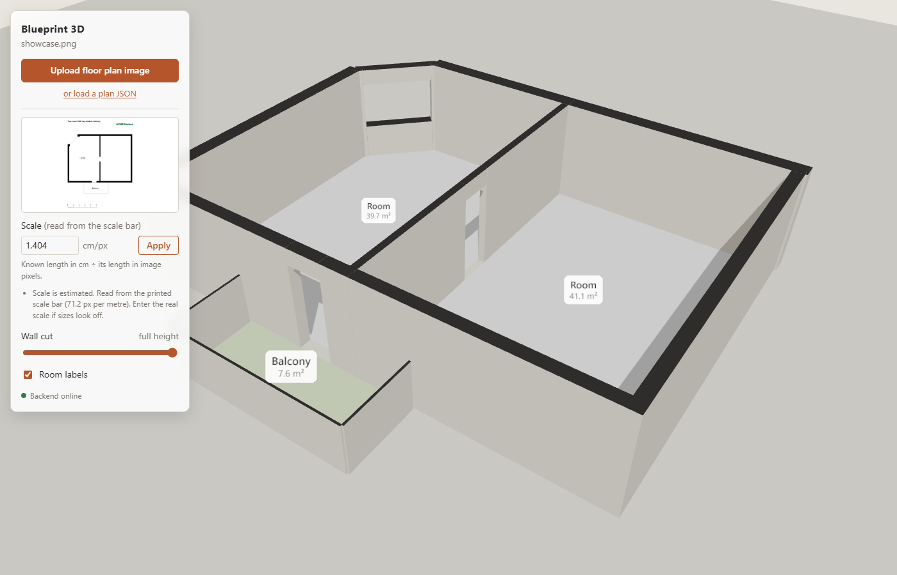
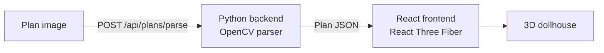
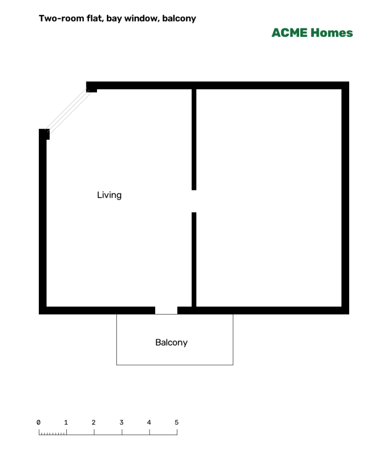
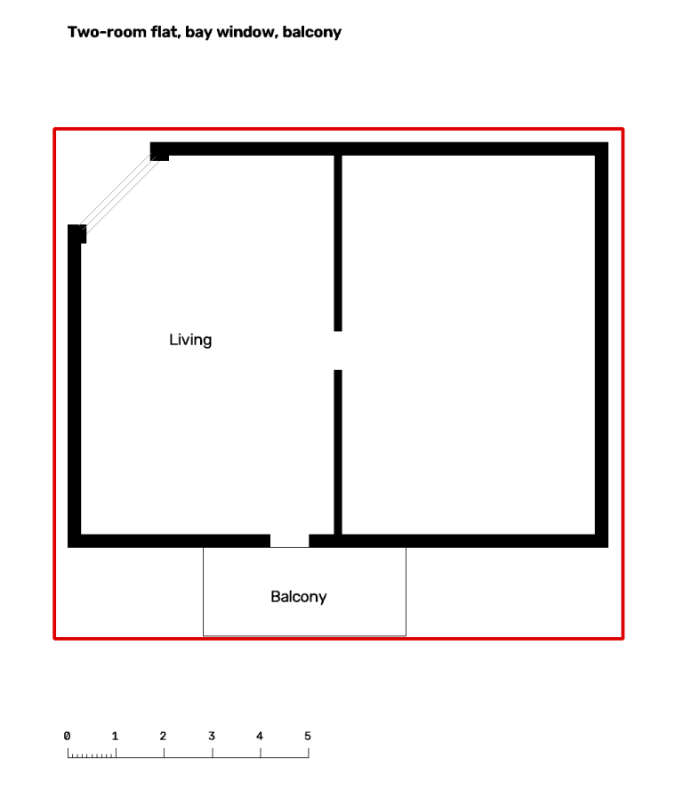
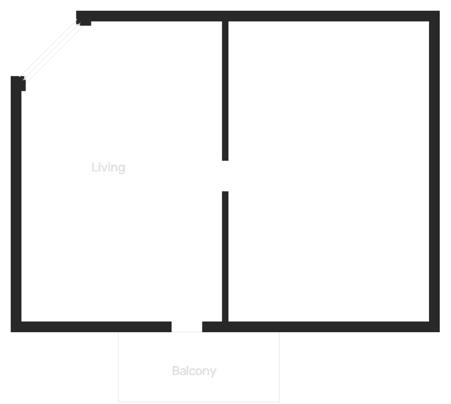
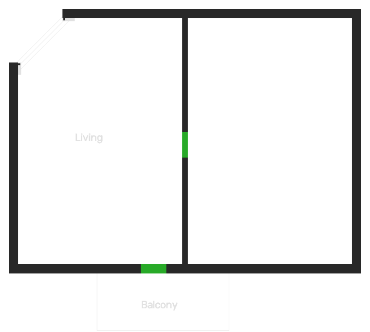
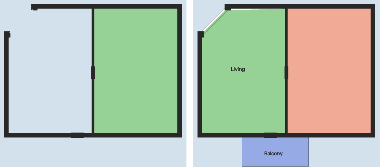
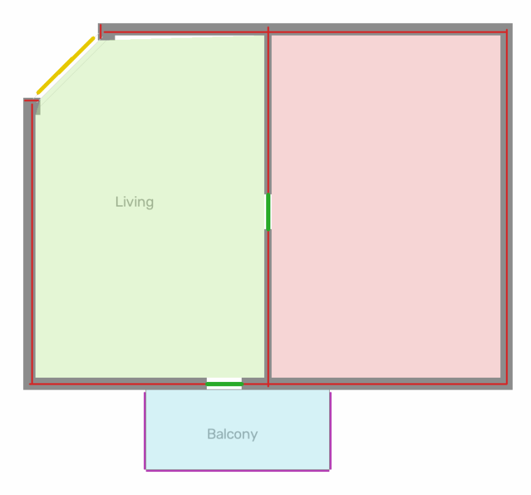

# Blueprint 3D

Upload a floor plan from an apartment rental listing and walk around it as a 3D dollhouse.



The interesting part is the step in between: turning a picture of a floor plan into structured
data (walls, doors, windows, rooms, in centimetres). This README walks through how that works,
one stage at a time, and points to the code for each stage.

> Personal / portfolio project. The parser is a classical computer-vision baseline (OpenCV); a
> learned model is on the roadmap. See [Limitations](#limitations-and-roadmap) for what it can't do yet.

---

## Contents

1. [Quick start](#quick-start)
2. [The big picture](#the-big-picture)
3. [The parser, step by step](#the-parser-step-by-step)
4. [From plan to 3D](#from-plan-to-3d)
5. [Measuring progress](#measuring-progress)
6. [Project layout and development](#project-layout-and-development)
7. [Limitations and roadmap](#limitations-and-roadmap)

---

## Quick start

With Docker:

```bash
docker compose up --build
```

Open <http://localhost:5173>, press **Upload floor plan image**, and pick a PNG, JPEG or WebP plan.
The backend runs on <http://localhost:8000>; its API docs are at `/docs`.

Without Docker, you need [uv](https://docs.astral.sh/uv/) and Node 22:

```bash
uv sync
uv run uvicorn blueprint3d.api:app --reload      # backend on :8000

cd frontend
npm install
npm run dev                                      # frontend on :5173, proxies /api to :8000
```

---

## The big picture



The system is split in two:

- **The backend** (Python, FastAPI, OpenCV) does the hard part: *image to plan*.
- **The frontend** (React, three.js via React Three Fiber) does the easy part: *plan to 3D*.

What passes between them is the **plan**, a small JSON document. It is the contract of the whole
project:

```jsonc
{
  "walls":    [{ "id": "w1", "start": {"x": 0, "y": 0}, "end": {"x": 800, "y": 0},
                 "thickness": 25, "height": 250, "exterior": true }],
  "openings": [{ "id": "o1", "wall_id": "w1", "kind": "window",
                 "offset": 200, "width": 150 }],   // offset = distance from wall start to the opening's centre
  "rooms":    [{ "id": "r1", "kind": "balcony",
                 "polygon": [{"x": 0, "y": 0}, {"x": 450, "y": 0}, {"x": 450, "y": 500}] }]
}
```

Everything is in **centimetres**, with the origin at the top-left and y pointing down, just like
the image. The schema is defined in [`src/blueprint3d/schema.py`](src/blueprint3d/schema.py)
(pydantic, the source of truth) and mirrored in [`frontend/src/plan/schema.ts`](frontend/src/plan/schema.ts) (zod).

Because the plan is a plain, validated format, the two halves are independent. A better parser
(say, a neural network) can replace the OpenCV one without touching the renderer. A plan
can also be written by hand and loaded with **or load a plan JSON**.

---

## The parser, step by step

A rental floor plan is a surprisingly hostile image. Besides walls it has room names, furniture,
door swings, dimension marks, logos, coloured fills, scale bars and site maps. The parser's job is
to decide, pixel by pixel and then shape by shape, what is architecture and what is decoration.

It does this in nine steps, orchestrated by
[`parsing/opencv_parser.py`](src/blueprint3d/parsing/opencv_parser.py). Each step lives in its
own small module. The figures below show every step on a synthetic example plan: two rooms, a
cut-off corner with a window (a "bay"), a balcony, a coloured logo and a scale bar.



### 1. Reading the image — [`image_io.py`](src/blueprint3d/parsing/image_io.py)

The uploaded bytes are decoded, transparent backgrounds are put on white, and very large images
are scaled down to at most 2500 px (the scale factor is remembered, so measurements can be
reported in the original image's pixels).

The image is then converted to grayscale, with one twist: **coloured pixels are treated as
paper.** Floor plans draw architecture in black and gray, while logos, tinted room fills and
highlights are coloured. A pixel whose colour channels differ by more than a threshold
(its *chroma*) is whitened, along with a one-pixel halo around it.

### 2. Two kinds of ink — [`image_io.py`](src/blueprint3d/parsing/image_io.py)

Two binary images come out of the grayscale one:

- **Dark ink.** Otsu thresholding picks the cut between "paper" and "ink" automatically. It
  captures walls, text and furniture reliably.
- **Line ink.** Dark ink plus *light gray lines*. Many plans draw windows, railings and scale
  bars in light gray, which Otsu drops. The catch is room fills: a light-gray balcony floor is
  just as light as a window line. The difference is shape. A fill is a large, uniform area, so
  anything that survives a morphological *opening* with a 15 px square is a fill and is
  discarded. Lines drawn *inside* a fill are recovered with a *black-hat* filter, which finds
  strokes darker than their immediate surroundings.

Black is dark ink, gray is light-only ink. The logo is gone. The red box is where the next step
decides the plan is.



### 3. Finding the walls, and the plan — [`walls.py`](src/blueprint3d/parsing/walls.py)

**What is a wall?** In almost every rental plan, walls are the *thickest* strokes. To measure
stroke thickness, the parser runs a *distance transform* (each ink pixel gets its distance to the
nearest paper pixel). Along the centre line of each stroke this equals half the stroke's width.
Collecting those values gives a histogram of stroke widths across the plan, which typically
looks like this:

```
 2 px  ████████████████  text, furniture, door swings
 3 px  ██
 4 px  █
 5 px                    ← a gap
 8 px  ██████            walls
14 px  ███████████████
24 px  ███████           exterior walls
```

The threshold goes into the **first clear jump** of that histogram. Everything thicker is kept
by a morphological opening with a square kernel of that size: a square only fits inside strokes
at least as wide as itself.

Thin interior partitions are a special case. At 6 px they are barely thicker than bold 4 px
text. They pass a weaker jump test *only if* they also contain a long straight run (8× their
width), which letters never do.

**Where is the plan?** A plan page also has titles, legends, site maps and scale bars.
The parser clusters the wall pixels. It starts from the biggest cluster and adds nearby clusters
of substantial size, then grows the box to include thin drawings *physically connected* to the
walls, such as the balcony outline. Then it recomputes the wall threshold using only the strokes
inside the box, because page headings would otherwise skew the histogram.



### 4. Straight wall pieces — [`segments.py`](src/blueprint3d/parsing/segments.py)

A mask of wall pixels is not yet a list of walls. Horizontal wall pieces are extracted with an
opening using a *long, one-pixel-tall* kernel. Only horizontal runs longer than any wall is
thick survive, so vertical walls vanish from that image. The same with a tall kernel gives the
vertical pieces. Each connected piece becomes an `AxisSegment`: which axis, its centre line,
where it starts and ends, and its thickness.

Wall pixels explained by neither pass are *angled* walls. Each leftover blob is fitted with a
rotated rectangle.

### 5. Doors and windows — [`openings.py`](src/blueprint3d/parsing/openings.py)

Doors and windows are not drawn as walls. They are **gaps in walls**. So pieces that lie on the
same line are chained together, and each gap of plausible size between them becomes an opening.
Tiny gaps are scan noise and are closed; huge gaps mean two separate walls.

**Door or window?** Look inside the gap, along the wall:

- A **window** is drawn as two or more *solid* lines running along the wall (the frame and
  the glass).
- A **door** leaves the gap empty. Its leaf and swing arc sit *beside* the wall.
- A *dashed* line marks an open passage, not a window, so a line only counts if it covers at
  least 90% of the gap.

Later, once the parser knows where "outside" is, a window with rooms on both sides becomes a
door. Windows need outside air.



### 6. Scale — [`scale.py`](src/blueprint3d/parsing/scale.py), [`scale_bar.py`](src/blueprint3d/parsing/scale_bar.py)

So far everything is in pixels. To get centimetres the parser needs the **scale**, and it tries
these sources in order of trust:

1. **The user's value**, from the frontend's scale field.
2. **The printed scale bar.** Look for a long line or band outside the plan whose tallest marks
   repeat at a regular spacing. That spacing is taken as one metre. Both styles found on rental
   plans work: tick marks on a line, and a band with alternating fills.
3. **The page format.** A page with A4 proportions is assumed to be printed at 1:100 (very
   common for rental plans), so 29.7 cm of paper equals 29.7 m of apartment.
4. **Door widths.** The median door gap is assumed to be 80 cm.
5. **Wall thickness.** The thickest walls are assumed to be 30 cm.

Sources 2 and 3 rest on assumptions (1 m steps, 1:100 printing). So they are dropped when the
door estimate disagrees with them by more than a factor of 1.6, which catches a bar marked in
5 m steps or a plan printed at 1:50.

### 7. Rooms — [`rooms.py`](src/blueprint3d/parsing/rooms.py)

A room is **enclosed free space**. First, every door and window gap is *plugged* with a
rectangle, so rooms don't leak into each other through doors. Then the connected regions of
paper are labelled; regions touching the image border are *outside*.

This runs twice, because each version fails differently:

- **Thick walls only** (left). Clean rooms that ignore door swings and furniture. But a room
  bounded partly by thin lines, like the bay window, leaks outside and is lost.
- **All ink** (right). Finds the living room behind the bay window and the balcony behind its
  thin railing. But furniture lines chop rooms into pieces.

The parser keeps the thick-wall rooms and adds the all-ink rooms only where the thick-wall pass
saw "outside". Small pockets cut off by thin lines (cupboards, counter strips, door-swing wedges)
are absorbed into the room they open onto, never across a wall, so floors have no holes.



### 8. Completing room outlines — [`boundaries.py`](src/blueprint3d/parsing/boundaries.py)

Some rooms are now bounded by lines that are not walls yet: the bay window, the balcony
railing, a door in an angled wall. The parser walks around each room's outline. Wherever the
outline is not next to a known wall, it **probes outward** to see what lies beyond. Probes stop at
known walls, so a cupboard drawn against a wall is never mistaken for one.

| Beyond the stretch of outline | Becomes |
|---|---|
| Outside, and ≥ 25% of the room's outline is like this | A **balcony**: every such stretch becomes a railing (5 cm thick, half height) |
| Outside, behind two or more parallel lines | An **exterior wall with a window**. This is how angled walls are built |
| Outside, behind a single line (e.g. a door leaf drawn outside) | Nothing |
| Another room, across thin lines | A **wall with a door** along the chord |

### 9. Tidying up and converting — [`merge.py`](src/blueprint3d/parsing/merge.py), [`plan_builder.py`](src/blueprint3d/parsing/plan_builder.py)

- **Merging.** Some plans draw walls as *outlines*: two parallel lines. That produces two thin
  walls side by side. Parallel walls of the same height that overlap and lie within 45 cm merge
  into one wall spanning both faces.
- **Exterior walls.** A wall with outside space just beyond either face is marked exterior.
- **Centimetres.** Pixel coordinates are multiplied by the scale. Every opening is checked to
  fit inside its wall, and the result is validated against the plan schema.

The response also carries metadata: the scale and where it came from, warnings, and
`origin_px`, which is where plan (0, 0) sits in the uploaded image.

Here is the finished plan drawn back onto the input:

- **Red:** exterior walls. **Blue:** interior walls. **Purple:** low walls (railings).
- **Green:** doors. **Yellow:** windows.
- **Tinted areas:** rooms.



---

## From plan to 3D

The frontend ([`frontend/src`](frontend/src)) receives the plan and builds the scene.
The geometry maths is kept apart from the React components, so it can be unit-tested.

- **Validation**, [`plan/schema.ts`](frontend/src/plan/schema.ts). Uploaded or received plans
  are checked with zod and get defaults (wall height 250 cm, door height 210 cm, window sill
  90 cm, …).
- **Walls with holes**, [`geometry/walls.ts`](frontend/src/geometry/walls.ts). Instead of
  boolean operations, each wall is split into solid boxes *around* its openings: a full-height
  box between openings, and a sill box below plus a lintel box above each opening. Each wall is
  extended by half its thickness at both ends, so corners close without gaps. The cut-height
  slider simply clips every box.
- **Floors**, [`scene/Floors.tsx`](frontend/src/scene/Floors.tsx). Each room polygon becomes a
  flat `ShapeGeometry`, coloured by room kind.
- **Labels**, [`scene/labels.ts`](frontend/src/scene/labels.ts). Room name and area are drawn
  to a canvas and shown as a sprite, which always faces the camera.
- **Units.** Plans are in centimetres and the scene in metres. Plan (x, y) becomes world
  (x, z) with y up. The only conversion point is `CM_TO_M`.

---

## Measuring progress

Heuristics that fix one plan can quietly break another, so every parser change is measured
against real plans:

```bash
uv run python -m blueprint3d.evaluation        # parses every image in data/
```

Each plan in `data/` is scored against `data/truth.json`. That file holds only facts readable
off the drawing: the true scale (from its scale bar), the printed living area, and the number of
rooms and balconies. The harness prints a table and writes `eval-out/overview.png`: every plan
with its overlay and scores, side by side.

Living area is measured the way Swedish plans print it (BOA, SS 21054): inside the exterior
walls, *including* interior walls, excluding balconies.

Results at the time of writing, on five real Swedish rental plans:

| Plan style | Scale error | Area error | Rooms | Result |
|---|---|---|---|---|
| Modern export, colour, logo, thick walls | 0.0% | −10.0% | 7/7 | pass (at the edge) |
| Clean vector plan with a bay window | −0.1% | −1.9% | 7/7 | pass |
| Scanned, solid walls, open-plan kitchen | +0.3% | −1.7% | 5/6 | pass |
| Scanned, outlined (double-line) walls | +0.1% | (not printed) | 7/8 | pass |
| Scanned, hatched walls | – | – | 0/10 | not supported yet |

The plans themselves are not in the repository: they are git-ignored, since real listings may
be copyrighted. The figures in this README come from synthetic plans drawn by
[`tests/parsing/synthetic.py`](tests/parsing/synthetic.py).

---

## Project layout and development

```
src/blueprint3d/
  schema.py            the plan format (source of truth)
  api.py               FastAPI: /api/health, /api/plans/validate, /api/plans/parse
  parsing/             image -> plan (one module per step above)
  evaluation/          scoring against real plans
frontend/src/
  plan/                zod mirror of the schema
  geometry/            pure, tested 3D maths
  scene/               React Three Fiber components
  api/, app/, ui/      backend calls, state, control panel
tests/                 pytest; tests/parsing/synthetic.py draws test plans
docs/                  README figures (uv run python docs/make_figures.py)
docker/, compose.yaml  development stack with hot reload
```

```bash
uv run pytest                     # backend tests
cd frontend && npm test           # frontend tests
cd frontend && npm run lint       # oxlint
```

Contributor and AI-agent conventions are in [CLAUDE.md](CLAUDE.md).

---

## Limitations and roadmap

**Not handled yet:**

- **Hatched walls** (stippled fill between two lines) on older scanned plans: no walls are
  found.
- **Room names aren't read**, so every room is "Room" with the same floor colour.
- **Curved walls** are approximated or missed.
- **Scale assumptions:** a scale bar is assumed to be marked in whole metres, and an A4 page at
  1:100. Both are cross-checked, and the user can always enter the scale by hand.

**Next:**

1. **Hatched and outlined walls:** fill between parallel lines before wall detection.
2. **Room names by OCR** (e.g. SOVRUM, KÖK, BAD): room kinds, floor colours, and the printed
   area as a second scale check.
3. **A learned parser:** a segmentation model trained on
   [CubiCasa5K](https://github.com/CubiCasa/CubiCasa5k), plus our own raster-to-vector step,
   compared against this baseline with the evaluation harness.
4. **A correction editor** in the frontend: drag a wall, relabel a room, set the scale by
   clicking two points. `origin_px` already maps the plan back onto the image.
